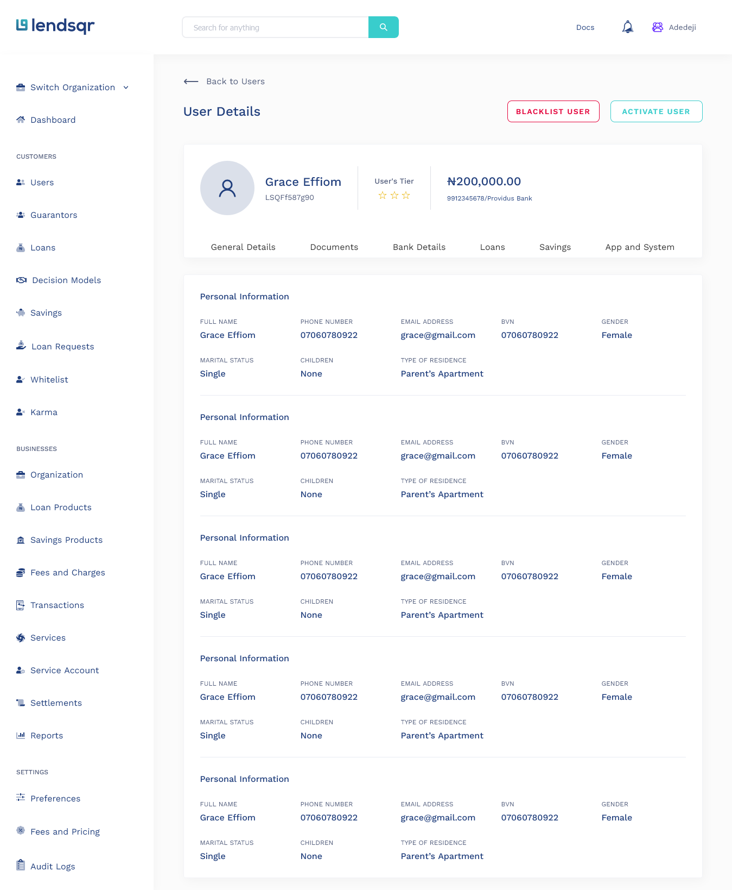

# Lendsqr Assessment -

This is a solution to the [Advice generator app challenge on Frontend Mentor](https://www.frontendmentor.io/challenges/advice-generator-app-QdUG-13db). Frontend Mentor challenges help you improve your coding skills by building realistic projects.

## Table of contents

- [Overview](#overview)
  - [The challenge](#the-challenge)
  - [Screenshot](#screenshot)
  - [Links](#links)
- [My process](#my-process)
  - [Built with](#built-with)
- [Author](#author)

## Overview

### The challenge

Users should be able to:

- Build the 4 pages Login, Dashboard, User page, User details page
- The user pages should pull data from a mock api with 500 records
- Use local storage or indexedDB to store and retrieve user details on the user details page.
- The page must be mobile responsive

### Screenshot

This is a preview of the project.

### Links

- Live Site URL: [lendsqr-salsod](https://demo.com)

## My process

### Built with

- Semantic HTML5 markup
- SCSS
- CSS Flexbox
- CSS Grid
- Desktop-first workflow
- [React](https://reactjs.org/) - JS library

## Author

- linkedin - [Salaudeen Sodiq](https://www.linkedin.com/in/salsod)
- Twitter - [@Learn\_\_soft](https://www.twitter.com/Learn__soft)
